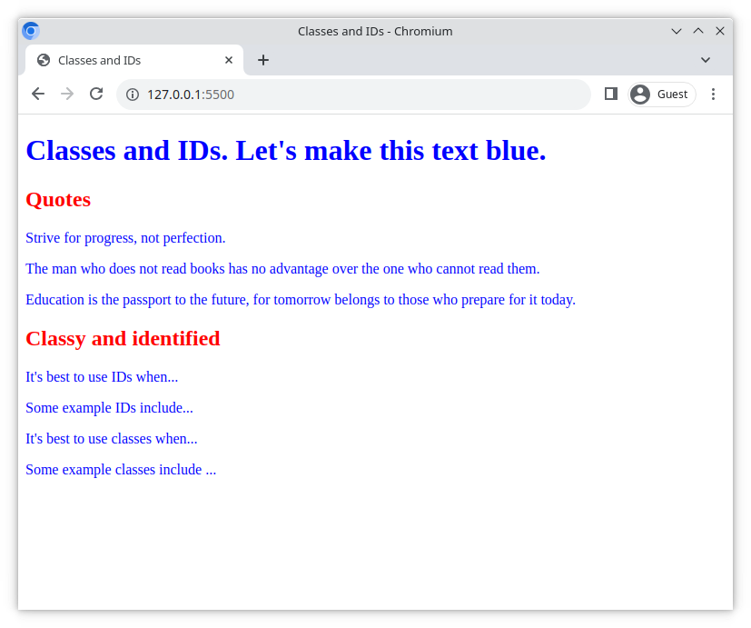

# Classes and IDs

This exercise will train you in the use of the HTML `id` attribute, as well as the `class` attribute for styling.

## Tasks

### Task 1

Examine the `index.html` file. What `id`s and `class`es are in use?

In the file `style.css`;

- Remove the `font-size` properties
- Modify the CSS so that all the text on the page is blue
- Use at least one `class` and one `id` attribute for coloring

> Don't edit the HTML file for this task! 😎

### Task 2

- Add some CSS to make the `<h2>Quotes</h2>` element red

### Task 3

- Add a new `section` element inside the `main` element
- Inside the new `section`, add an `h2` element;
  - with the text content "Classy and identified"
  - in the color red

### Task 4

Inside the new `section` add two `p` elements:

- In the first `p` element, explain when to use an `id`
- In the second `p` element, give some example values that work for an `id`

### Task 5

Inside the new `section` add a further two `p` elements:

- In the first `p` element, explain when to use a `class`
- In the second `p` element, give some example values that work for a `class`

### Bonus task

- Improve the HTML by removing all the `div` elements
- Add different background colors to the `header` and `main` elements

## Reference

